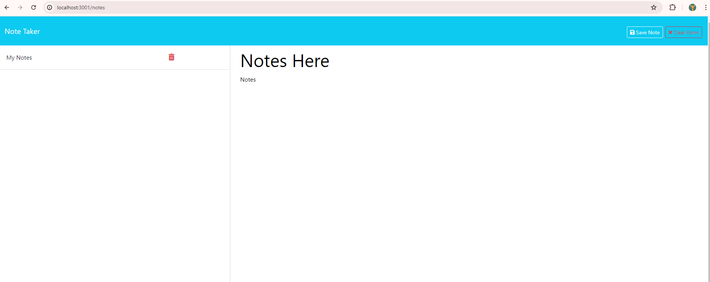

# Note Taker Challenge    

## Table of Contents
- [Description](#description)
- [Installation](#installation)
- [Usage](#usage)
- [Contributors](#contributing)
- [Tests](#tests)
- [License](#license)
- [Questions](#questions)

## Description
This is an application that can be used to write, save and delete notes. 

## Usage
To use the application, navigate to https://sleepy-sea-90725-952b798b362a.herokuapp.com/. Write the notes and click the save button and notes will be saved. Additionally, user can delete saved notes by clicking on the trash icon.

## Contributing
Contributors are welcome! If you encounter issues or have any suggestions, open an issue to GitHub.

## Questions
  My GitHub profile is: jeninadelacruz521@yahoo.com [View on GitHub](https://github.com/jeninadelacruz521@yahoo.com)

  For additional questions, contact me at email address: jenina52112
